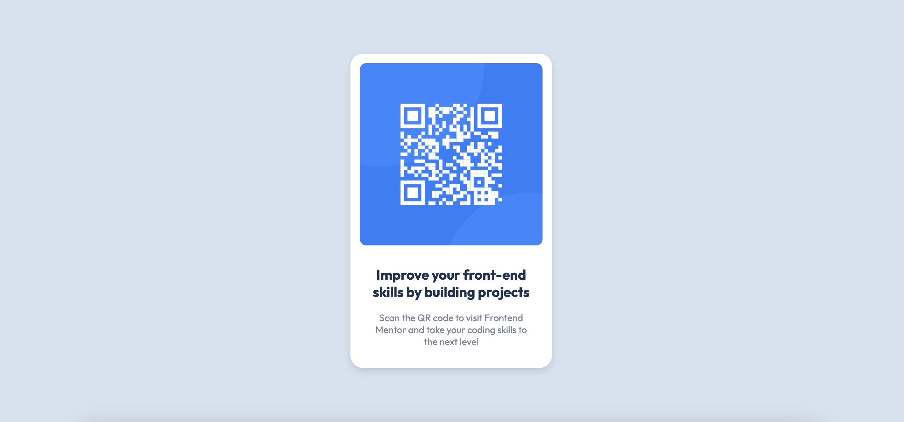

# Frontend Mentor - QR code component solution

This is a solution to the [QR code component challenge on Frontend Mentor](https://www.frontendmentor.io/challenges/qr-code-component-iux_sIO_H). Frontend Mentor challenges help you improve your coding skills by building realistic projects. 

## Table of contents

- [Overview](#overview)
  - [Screenshot](#screenshot)
  - [Links](#links)
- [My process](#my-process)
  - [Built with](#built-with)
  - [What I learned](#what-i-learned)
  - [Continued development](#continued-development)
- [Author](#author)

## Overview

### Screenshot



### Links

- Solution URL: [solution URL](https://www.frontendmentor.io/solutions/qr-code-component-challenge-solution-using-flexbox-OhFqm0sRqM)
- Live Site URL: [live site URL](https://leo-code-ca.github.io/qr-code-component/)

## My process

### Built with

- Semantic HTML5 markup
- CSS custom properties
- Flexbox

### What I learned

I mostly used Flexbox for this project. It's definitely one of my favorite CSS tools! I feel like (almost!) everything is doable with it!

I also used the absolute position for the paragraph under the figure. It's something that was not really intuitive for me at the beginning of my coding journey but I feel more and more comfortable with it. 

```css
.attribution {
  position: absolute;
  bottom: 5%;
  left: 50%;
  transform: translate(-50%);
}
```

Finally, when I code these days, I try to use attribute selectors as much as I can as I need to practice to remember them!

```css
[class$="caption"] {
  text-align: center;
}
```

### Continued development

I DEFINITELY want to keep learning JavaScript to be able to create a "one way only" transition. My paragraph at the bottom of the viewport is hidden until the user hovers over the figure, that's good. However I'd like it to stay visible after unhover and I haven't found a css only solution to achieve that, even after a lot of online searches. Everyone seems to say it's easily doable with a little of JavaScript so, I'm looking forward to learn how to do so!

I also would like to keep working on my box-shadows. I feel like there are a lot of good looking things to create with it but I still need some practice as well!

## Author

- Frontend Mentor - [@Leo-Code-CA](https://www.frontendmentor.io/profile/Leo-Code-CA)
- FreeCodeCamp - [@Leo-code](https://www.freecodecamp.org/Leo-code)
